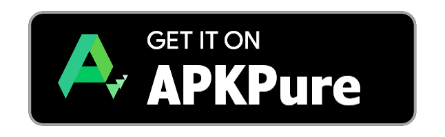
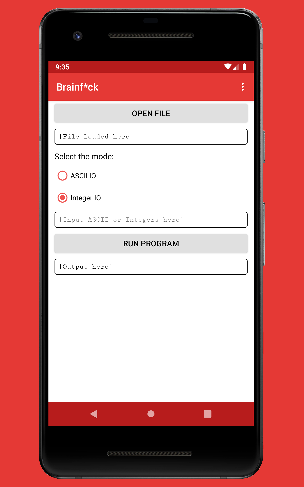
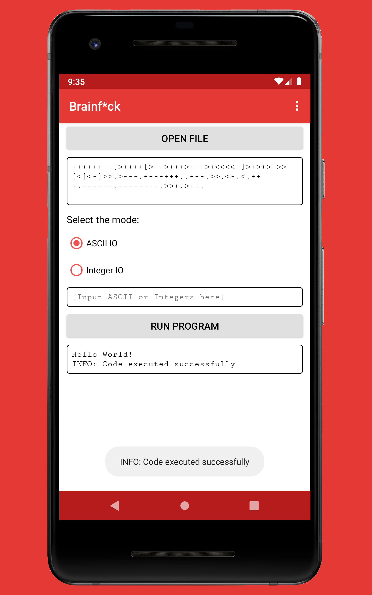
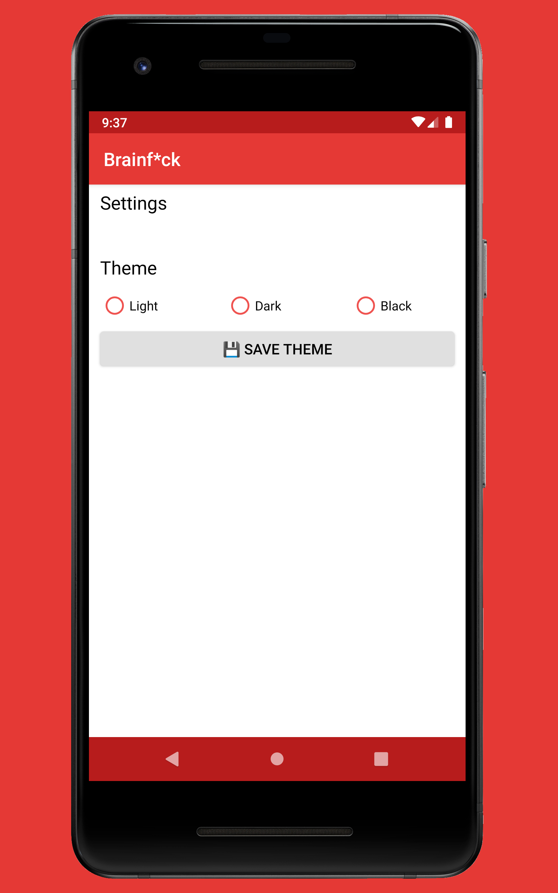
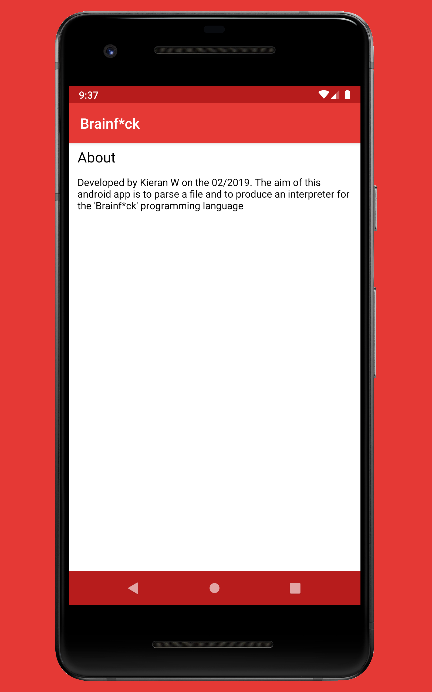
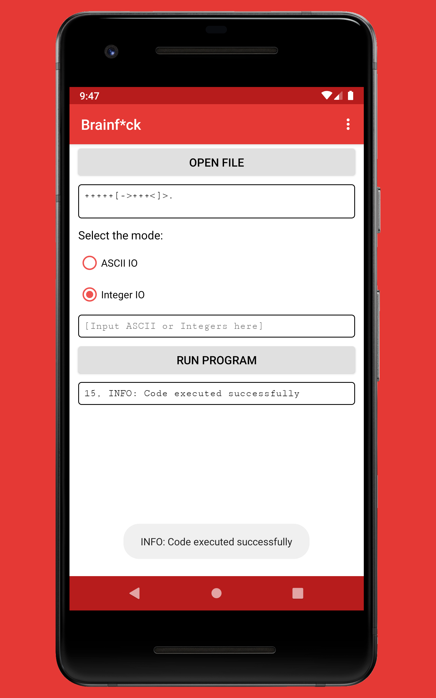
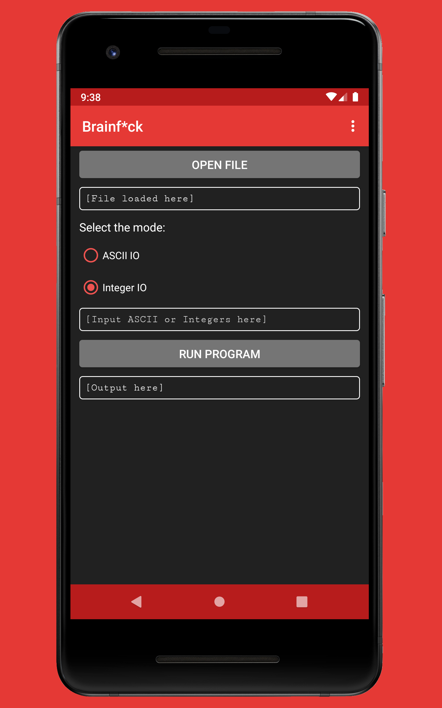
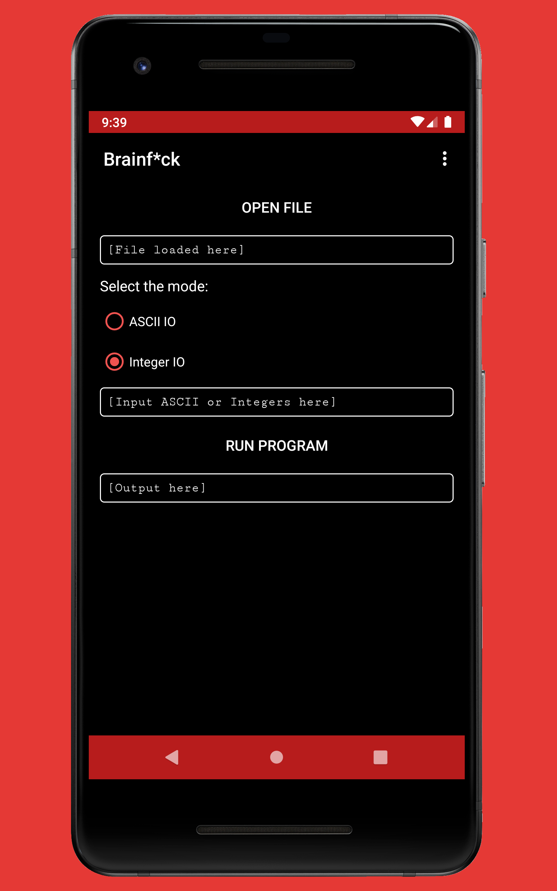

# Android.Brainf*ckInterpreter

The aim of this android app is to parse a file and to produce an interpreter for the 'Brainfuck' programming language

# Language Information 

## Java and Android Version
This app has been written in the Java programming language with the Android Studio IDE.
- The target SDK version is 28 (Android 9.0 Pie)
- The minimum SDK version is 22 (Android 5.1 Lollipop)

## Download Android Studio
Download the Android Studio IDE from https://developer.android.com/studio/. For Windows, double click the downloaded .exe file and follow the instructions provided by the installer - it will download the Android emulator and the Android SDK. Additional information can be found at https://developer.android.com/studio/install

## Build From Source
1. Download or clone this GitHub repository
2. (If downloaded) Extract the zip archive
3. In Android Studio click File > Open and then navigate to the project file (Android studio defaults to the directory of the last opened file)

<!--
## Get it on Google Play 
1. Open the Google Play app
2. Search for [app_name] 
### Or

Follow the link to the listing on Google Play by clicking on the badge above, then download/ install
-->

## Available at Amazon Appstore 
1. Open the Amazon Appstore (can be downloaded from https://www.amazon.co.uk/androidapp)
2. Search for [app_name] 
### Or

Follow the link to the listing on the Amazon Appstore by clicking on the badge above, then download/ install

## Download the APK 
1. Navigate to the [app_name]-APKs directory
2. Select the debug or release APK depending on your preference. Note that the filenames are in the form: app-[debug/release]-yyyymmdd.apk (I would recommend downloading the most recent release APK)
### Or

Follow the link to the APKs directory by clicking on the badge above, then select the preferred APK

<!--
## Get it on APKPure
1. Go to https://m.apkpure.com or open the APKPure app
2. Search for [app_name] or com.fredhappyface.[app_name]
### Or

Follow the link to the listing on apkpure.com by clicking on the badge above, then download/ install
-->

# Licence 
MIT License
Copyright (c) Kieran W
(See the [LICENSE](/LICENSE.md) for more information.)

# Screenshots
## General Usage 
|Screenshots| |
|:-:|:-:|
|  |  |
|  |  |
|  |  |

## Themes 
|Light|Dark|Black|
|:-:|:-:|:-:|
|  |  |  |
