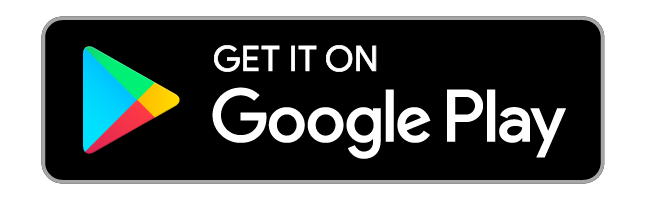
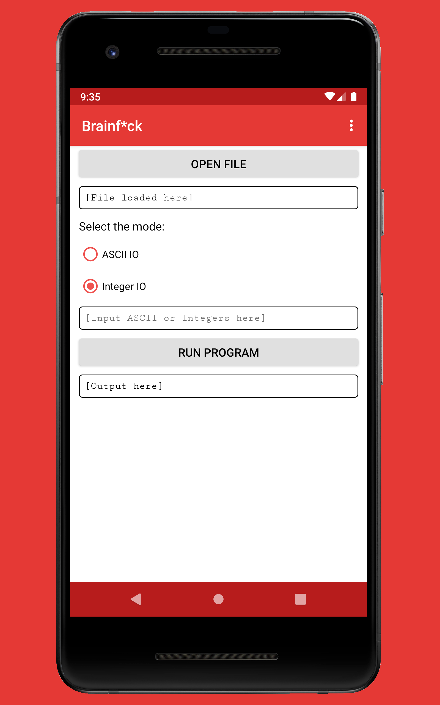
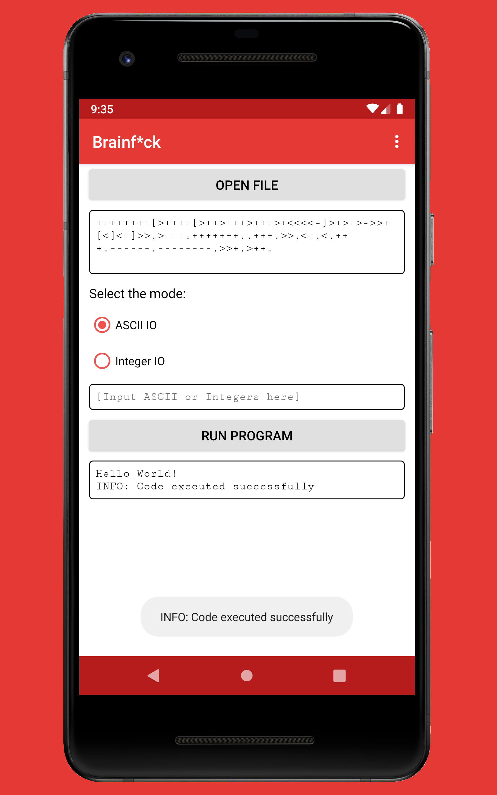
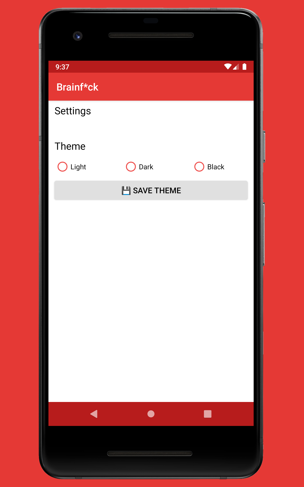
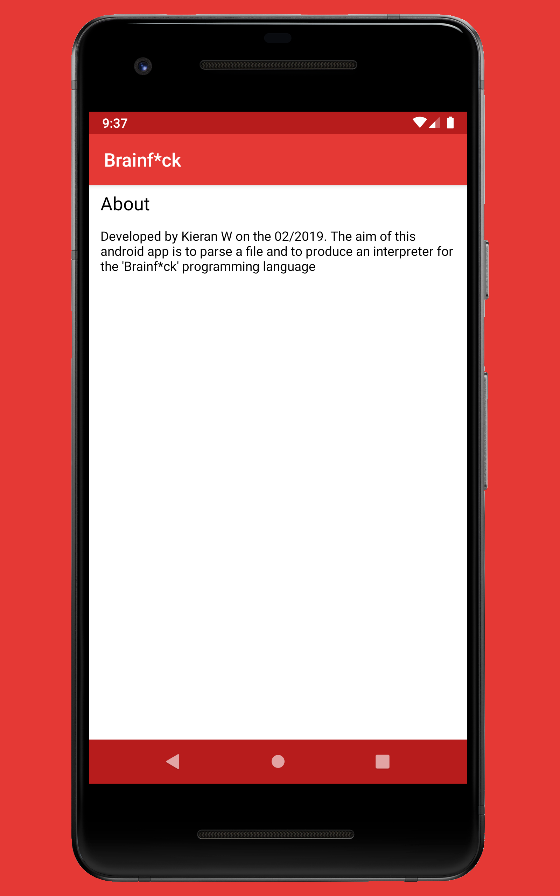
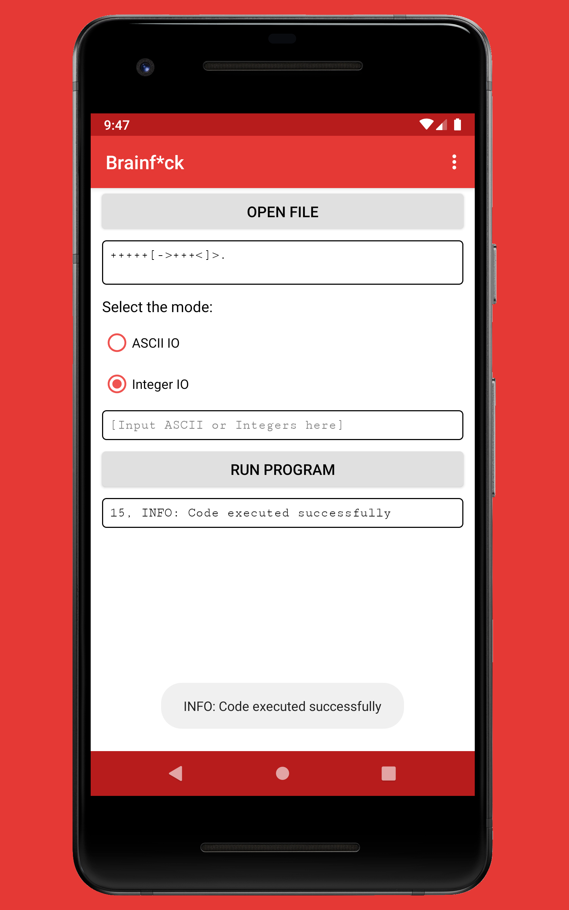
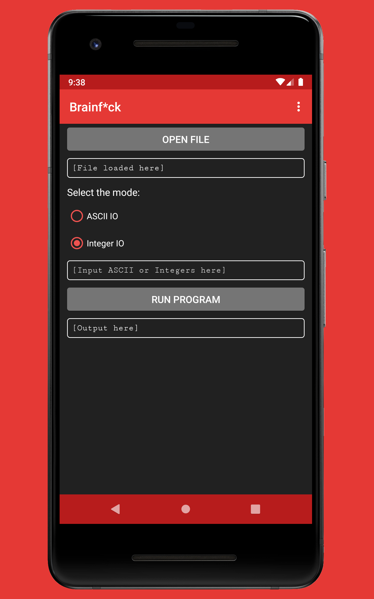
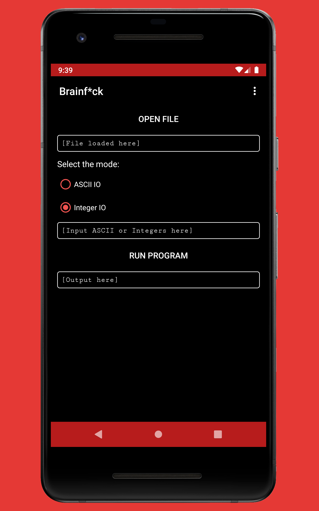

<p float="left">
<a href="../../"></a>
<a href="https://www.codacy.com/manual/FredHappyface/Android.Brainf"></a>
<a href="https://www.codacy.com/manual/FredHappyface/Android.Brainf"></a>
<a href="../../"></a>
<a href="../../issues"></a>
<a href="/LICENSE.md"></a>
<a href="../../commits/master"></a>
<a href="../../commits/master"></a>
</p>

# Android.Brainf


The aim of this android app is to parse a file and to produce an interpreter for the 'Brainf' programming language


## Language Information

### Java and Android Version
This app has been written in the Java 8 programming language with the Android
Studio IDE.
- The target SDK version is :target-sdk: (Android 29)
- The minimum SDK version is :minimum-sdk: (Android 22)

#### Install Java 8
##### OpenJDK8 (recommended)
Install with chocolatey
```powershell
choco install openjdk8
```
##### OracleJDK8
Install with chocolatey
```powershell
choco install jdk8
```
or download and install from
<https://www.oracle.com/technetwork/java/javase/downloads/jdk8-downloads-2133151.html>

#### Download an IDE
##### Download Intellij Community
Download the Intellij Community from <https://www.jetbrains.com/idea/download/>.
For Windows, double click the downloaded .exe file and follow the instructions
provided by the installer. Install the Android SDK through Intellij.

Install with chocolatey
```powershell
choco install intellijidea-community
```

##### Download Android Studio
Download the Android Studio IDE from <https://developer.android.com/studio/>.
For Windows, double click the downloaded .exe file and follow the instructions
provided by the installer - it will download the Android emulator and the
Android SDK. Additional information can be found at
<https://developer.android.com/studio/install>

## How to Run
### Build From Source
1. Download or clone this GitHub repository
2. (If downloaded) Extract the zip archive
3. In Android Studio click File > Open and then navigate to the project file
(Android studio defaults to the directory of the last opened file)

<!--
### Get it on Google Play
1. Open the Google Play app
2. Search for Brainf
**Or**
[](https://play.google.com/store/apps/)

Follow the link to the listing on Google Play by clicking on the badge above,
then download/ install
-->


### Available at Amazon Appstore
1. Open the Amazon Appstore (can be downloaded from
<https://www.amazon.co.uk/androidapp>)
2. Search for Brainf

**Or**

[
](http://www.amazon.com/gp/mas/dl/android?p=com.fredhappyface.brainf&ref=mas_pm_Brainf)

Follow the link to the listing on the Amazon Appstore by clicking on the badge
above, then download/ install


### Download the APK
1. Navigate to the Brainf-APKs directory
2. Select the debug or release APK depending on your preference. Note that the
filenames are in the form: app-(debug/release)-yyyymmdd.apk (I would recommend
downloading the most recent release APK)

**Or**

[](/APKs)

Follow the link to the APKs directory by clicking on the badge above, then
select the preferred APK


## Changelog
See the [CHANGELOG](/CHANGELOG.md) for more information.

## Download
### Clone
#### Using The Command Line
1. Press the Clone or download button in the top right
2. Copy the URL (link)
3. Open the command line and change directory to where you wish to
clone to
4. Type 'git clone' followed by URL in step 2
```bash
$ git clone https://github.com/FredHappyface/Android.Brainf
```

More information can be found at
<https://help.github.com/en/articles/cloning-a-repository>

#### Using GitHub Desktop
1. Press the Clone or download button in the top right
2. Click open in desktop
3. Choose the path for where you want and click Clone

More information can be found at
<https://help.github.com/en/desktop/contributing-to-projects/cloning-a-repository-from-github-to-github-desktop>

### Download Zip File

1. Download this GitHub repository
2. Extract the zip archive
3. Copy/ move to the desired location


## Licence
MIT License
Copyright (c) FredHappyface
(See the [LICENSE](/LICENSE.md) for more information.)


## Screenshots

### Mobile
|Screenshots                                                                                 |                                                                                            |
|:-:                                                                                         |:-:                                                                                         |
|||
|||
|||


### Themes
|Light                                                                             |Dark                                                                              |Black                                                                             |
|:-:                                                                               |:-:                                                                               |:-:                                                                               |
||||
